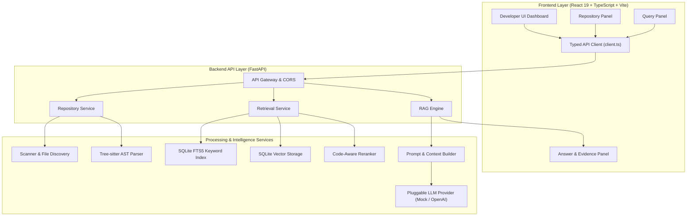

# RepoPilot

## AI Software Engineering Intelligence Platform & Grounded Repository Q&A Engine

[]()
[]()
[]()
[]()
[]()
[]()

---

> **Disclaimer:** RepoPilot is an original educational and job-portfolio project designed and implemented from scratch to demonstrate production AI engineering, code retrieval, and full-stack software architecture. It is **not** a commercial product used by external enterprise companies. All engineering decisions, evaluation metrics, and architectural trade-offs are documented with empirical rigor.

---

## Executive Summary & Problem Statement

**The Challenge:** Onboarding software engineers onto large, unfamiliar codebases requires days of manual file inspection to comprehend architectural layout, trace symbol dependencies, and locate relevant logic.

**The Solution:** RepoPilot is an AI software engineering intelligence platform that parses local code repositories into AST symbol trees (Tree-sitter), indexes chunks into SQLite FTS5 and vector stores, and executes hybrid search with deterministic **Code-Aware Reranking**. Developers ask natural language codebase questions and receive grounded answers backed by verified file paths, symbol names, and exact line ranges.

---

## Major System Capabilities

- **Repository Ingestion & Lifecycle Management** — Local directory scanning, path validation, and status tracking (`REGISTERED`, `INDEXING`, `READY`, `FAILED`).
- **AST Structural Code Parsing** — Language-aware parsing (Python, TypeScript, JavaScript) extracting function definitions, class structures, and symbol metadata.
- **Hybrid Retrieval Engine** — Reciprocal Rank Fusion (RRF) combining SQLite FTS5 BM25 keyword search and vector similarity embeddings.
- **Deterministic Code-Aware Reranking** — Precision re-scoring layer evaluating exact symbol names, filenames, API route decorators (`/health`), signatures, and docstrings without ML latency overhead.
- **Grounded Repository Q&A (RAG)** — Grounded LLM generation with bracketed citations (`[1]`, `[2]`), citation verification, and safe refusal when evidence is missing (`INSUFFICIENT_EVIDENCE`).
- **Developer UI Dashboard** — Sleek React 19 + TypeScript + Vite dashboard featuring live API health monitoring, repository controls, RAG parameter tuning, performance metrics, and citation cards.
- **Empirical Offline Evaluation Benchmark** — Reproducible evaluation suite measuring Recall@K, MRR, Grounded Answer Rate, and Citation Validity.
- **Production Packaging & CI/CD** — Multi-stage Docker containers, Docker Compose, and automated GitHub Actions CI pipeline.

---

## System Architecture



---

## Tech Stack

| Layer | Technology | Rationale |
|-------|-----------|-----------|
| **Frontend** | React 19 + TypeScript 5 + Vite 8 | Type safety, Vite dev server, crisp developer-tool UI |
| **Backend** | Python 3.11+ + FastAPI | High performance async endpoints, automatic OpenAPI documentation |
| **Code Parsing** | Tree-sitter | Language-agnostic structural AST parsing for functions and classes |
| **Indexing & Search** | SQLite FTS5 + SQLite Vector | Zero-dependency, offline-capable hybrid search engine |
| **Reranking** | Custom Deterministic Code Reranker | High-precision re-scoring without external ML latency |
| **AI / RAG Pipeline** | Pluggable LLM Provider (Mock + OpenAI) | Offline-testable, grounded prompt assembly with citation verification |
| **Containerization** | Docker + Docker Compose | Multi-stage production container build and local orchestration |
| **CI/CD** | GitHub Actions | Automated lint, unit tests, vitest suite, and build checks |

---

## Benchmark Evaluation Results

Evaluated offline against curated repository test cases across all retrieval modes using FastEmbed `sentence-transformers/all-MiniLM-L6-v2` (384-dimensional dense vectors):

| Metric | Keyword (BM25) | Semantic (FastEmbed 384d) | Hybrid (RRF + FastEmbed) | Benchmark Target |
|:---|:---:|:---:|:---:|:---:|
| **Retrieval Recall@K** | **100.0%** | **100.0%** | **100.0%** | ≥ 87.5% |
| **Retrieval MRR** | **1.0000** | **1.0000** | **1.0000** | ≥ 0.6458 |
| **Grounded Answer Rate** | **100.0%** | **100.0%** | **100.0%** | ≥ 87.5% |
| **Citation Validity Rate** | **100.0%** | **100.0%** | **100.0%** | 100.0% |
| **Insufficient Evidence Precision** | **100.0%** | **100.0%** | **100.0%** | 100.0% |
| **Average Query Latency** | **~933 ms** | **~1183 ms** | **~1184 ms** | < 2000 ms |

---

## Local Setup & Quickstart

### Prerequisites

- **Python 3.10+** (`python --version`)
- **Node.js 18+** (`node --version`)
- **Git** (`git --version`)

---

### 1. Local Development (Backend + Frontend)

#### Step 1: Start Backend API Engine

```bash
# Clone the repository
git clone https://github.com/rishav579/repo-pilot.git
cd repo-pilot

# Set up Python virtual environment
python -m venv .venv

# Activate virtual environment
# Windows: .venv\Scripts\Activate.ps1
# Linux/macOS: source .venv/bin/activate

# Install dependencies
pip install -r backend/requirements.txt

# Start backend server
cd backend
uvicorn app.main:app --reload --host 127.0.0.1 --port 8000
```
- **Backend API:** `http://127.0.0.1:8000`
- **Interactive Swagger Docs:** `http://127.0.0.1:8000/docs`

#### Step 2: Start Frontend UI

In a second terminal window:

```bash
cd frontend
npm install
npm run dev
```
- **Frontend Dashboard:** `http://localhost:5173`

---

### 2. Docker & Docker Compose Setup

Run the entire full-stack application inside production Docker containers:

```bash
# Build and start both backend and frontend containers
docker-compose up --build
```
- **Frontend UI:** `http://localhost:80`
- **Backend API:** `http://localhost:8000`

---

## Demo Workflow (Step-by-Step UI Guide)

1. **Open Frontend** — Navigate to `http://localhost:5173`. Ensure the status badge displays **API Engine Connected**.
2. **Register Repository** — Enter a local repository path (e.g. `C:/Projects/repo-pilot` or absolute path) and click **Register Repository**.
3. **Trigger Indexing** — Click **Trigger Full Indexing**. The status updates from `REGISTERED` → `INDEXING` → `READY`.
4. **Submit Code Question** — Enter a question in the textarea:
   > *"Where is scan_repository and validate_repository_path defined in scanner?"*
5. **Inspect Answer & Citations** — Review the generated answer, latency performance breakdown, and evidence cards with file paths (`scanner.py`), symbol names, and exact line ranges (`L55-L88`).
6. **Test Unanswerable Question** — Ask *"What is the password of the GitHub repository owner?"*. Observe that RepoPilot refuses to hallucinate and displays the **Insufficient Evidence Fallback** status badge.

---

## Running Automated Tests

### Backend Pytest Suite
```bash
cd backend
python -m pytest tests/ -v
```

### Retrieval Evaluation Benchmark
```bash
cd backend
python -m app.evaluation.eval_runner
```

### Frontend Vitest Suite & Production Build
```bash
cd frontend
npm test
npm run build
```

---

## Security & Architectural Trade-offs

- **Repository Isolation**: Indexed chunks are strictly tagged with `repository_id`. Queries scoped to a repository cannot return evidence from another codebase.
- **Prompt Injection Defense**: Untrusted code snippets are wrapped inside `<untrusted_retrieved_evidence>` XML tags with strict system instructions prohibiting directive execution.
- **Persistence Architecture & Ephemeral Hosting**: Local deployment uses persistent SQLite storage (`.repopilot_data.db`). On serverless or ephemeral container hosts without volume mounts, repository state resets upon container restart.

---

## Project Structure

```text
repo-pilot/
├── .github/
│   └── workflows/
│       └── ci.yml             # GitHub Actions CI workflow
├── backend/
│   ├── app/
│   │   ├── api/               # FastAPI controllers
│   │   ├── evaluation/        # Offline benchmark runner
│   │   ├── services/
│   │   │   ├── indexing/      # FTS5 & vector storage
│   │   │   ├── ingestion/     # Repository scanner
│   │   │   ├── parsing/       # Tree-sitter AST parser
│   │   │   ├── rag/           # RAG pipeline & prompt builder
│   │   │   ├── repository/    # Repository lifecycle management
│   │   │   └── retrieval/     # Hybrid search & Code-Aware Reranker
│   │   └── main.py            # FastAPI entry point
│   ├── tests/                 # 111 backend unit/integration tests
│   ├── .env.example
│   ├── Dockerfile
│   └── requirements.txt
├── frontend/
│   ├── src/
│   │   ├── api/               # Typed API client & contracts
│   │   ├── components/        # Header, RepositoryPanel, QueryPanel, AnswerPanel, EvidencePanel
│   │   ├── App.tsx            # Main workspace component
│   │   └── index.css          # Dark developer-tool design system
│   ├── .env.example
│   ├── Dockerfile
│   └── package.json
├── docker-compose.yml
└── README.md
```

---

## License

This project is licensed under the MIT License.
