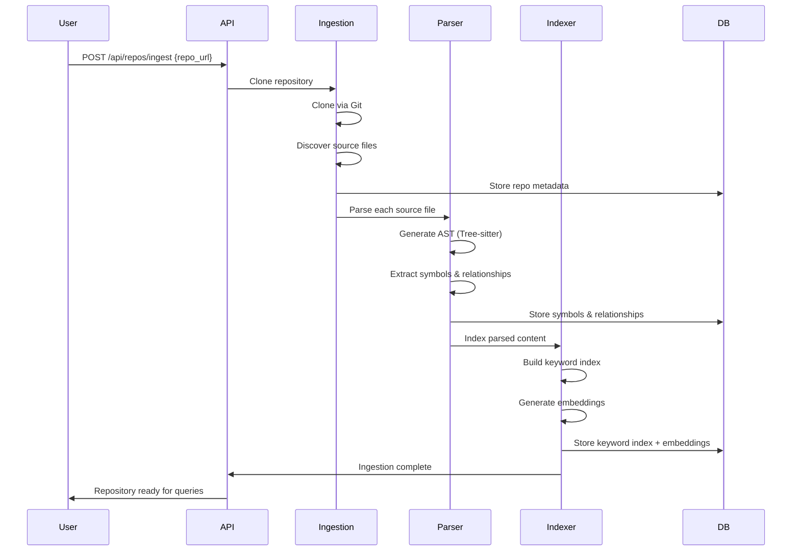
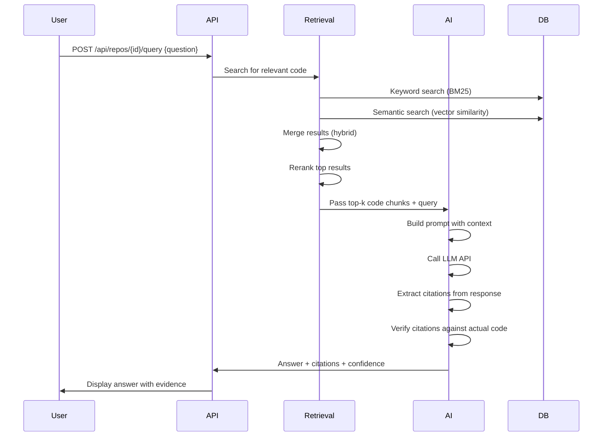

# RepoPilot — System Architecture

> **Document Status:** Living document. Updated as the system evolves.
>
> **Last Updated:** 2026-08-12 (Phase 0 — Foundation)

---

## Table of Contents

- [Overview](#overview)
- [High-Level Architecture](#high-level-architecture)
- [Components](#components)
- [Data Flow](#data-flow)
- [AI / RAG Pipeline](#ai--rag-pipeline)
- [Database Design Direction](#database-design-direction)
- [Security Considerations](#security-considerations)
- [Evaluation Strategy](#evaluation-strategy)
- [Future Scaling Path](#future-scaling-path)

---

## Overview

RepoPilot is a multi-layer system that ingests software repositories, parses and indexes the code, and enables AI-powered question answering with evidence-backed citations.

The architecture follows a clear separation of concerns:

1. **Ingestion Layer** — Gets the code into the system
2. **Parsing Layer** — Understands the code structure
3. **Indexing Layer** — Makes the code searchable
4. **Retrieval Layer** — Finds relevant code for a given query
5. **AI Layer** — Generates answers using retrieved context
6. **Evaluation Layer** — Measures quality and tracks errors

---

## High-Level Architecture

```mermaid
graph TB
    subgraph Frontend["Frontend (React + TypeScript + Vite)"]
        UI["User Interface"]
        QI["Query Input"]
        RD["Results Display"]
    end

    subgraph API["API Layer (FastAPI)"]
        GW["API Gateway"]
        AUTH["Auth / Config"]
        WS["WebSocket (future)"]
    end

    subgraph Ingestion["Ingestion Service"]
        GC["Git Clone / Pull"]
        FM["File Discovery"]
        META["Metadata Extraction"]
    end

    subgraph Parsing["Code Parsing"]
        TS["Tree-sitter Parser"]
        AST["AST Extraction"]
        SYM["Symbol Extraction"]
        REL["Relationship Mapping"]
    end

    subgraph Indexing["Indexing Service"]
        KW["Keyword Index"]
        EMB["Embedding Generator"]
        VEC["Vector Store"]
    end

    subgraph Retrieval["Retrieval Engine"]
        KS["Keyword Search"]
        SS["Semantic Search"]
        HM["Hybrid Merger"]
        RR["Reranker"]
    end

    subgraph AI["AI / LLM Layer"]
        PP["Prompt Builder"]
        LLM["LLM Provider (replaceable)"]
        CE["Citation Extractor"]
        HT["Hallucination Tracker"]
    end

    subgraph Eval["Evaluation"]
        RQ["Retrieval Quality"]
        AQ["Answer Quality"]
        HL["Hallucination Log"]
    end

    subgraph Data["Data Storage"]
        DB["SQLite (→ PostgreSQL)"]
        FS["File System (cloned repos)"]
    end

    UI --> GW
    QI --> GW
    GW --> Ingestion
    GW --> Retrieval
    GW --> AI
    GC --> FM --> META
    META --> DB
    FM --> TS
    TS --> AST --> SYM
    SYM --> REL
    SYM --> KW
    SYM --> EMB --> VEC
    KS --> HM
    SS --> HM
    HM --> RR
    RR --> PP
    PP --> LLM
    LLM --> CE
    CE --> HT
    HT --> HL
    CE --> RD
    RQ --> Eval
    AQ --> Eval
    DB --> KS
    VEC --> SS
    FS --> TS
```



---

## Components

### 1. Frontend (React + TypeScript + Vite)

**Responsibility:** User interface for interacting with RepoPilot.

| Subcomponent | What It Does |
|-------------|-------------|
| Query Input | Text input for natural language questions about a repository |
| Results Display | Shows AI answers with file/function citations and confidence indicators |
| Repository Browser | (Future) Navigate the ingested repository structure |
| Code Viewer | (Future) View source code with highlighted relevant sections |

**Key design decisions:**
- TypeScript for type safety and better developer experience
- Vite for fast hot-reload during development
- Component-based architecture for reusability

### 2. API Layer (FastAPI)

**Responsibility:** HTTP API gateway between frontend and backend services.

| Subcomponent | What It Does |
|-------------|-------------|
| API Gateway | Route requests to appropriate backend services |
| Auth / Config | Manage API keys and configuration (environment variables) |
| WebSocket | (Future) Stream long-running responses in real time |

**Endpoints (planned):**

| Method | Endpoint | Purpose |
|--------|---------|---------|
| POST | `/api/repos/ingest` | Ingest a new repository |
| GET | `/api/repos/{id}/status` | Check ingestion status |
| POST | `/api/repos/{id}/query` | Ask a question about a repository |
| GET | `/api/repos/{id}/structure` | Get repository structure |
| GET | `/api/repos/{id}/symbols` | List parsed symbols |
| POST | `/api/repos/{id}/search` | Hybrid code search |

### 3. Ingestion Service

**Responsibility:** Clone Git repositories and discover files for processing.

| Subcomponent | What It Does |
|-------------|-------------|
| Git Clone / Pull | Clone a repository or pull updates |
| File Discovery | Walk the file tree, filter by language, ignore binaries and vendor files |
| Metadata Extraction | Extract repo metadata: languages, file counts, sizes, commit info |

**Design notes:**
- Repositories are cloned to a designated directory on the file system
- File paths and metadata are stored in the database
- Large files and binary files are skipped during parsing

### 4. Code Parsing (Tree-sitter)

**Responsibility:** Parse source code into structured representations.

| Subcomponent | What It Does |
|-------------|-------------|
| Tree-sitter Parser | Generate Abstract Syntax Trees (ASTs) for each source file |
| AST Extraction | Walk the AST to extract structural information |
| Symbol Extraction | Identify functions, classes, methods, imports, variables |
| Relationship Mapping | Map which symbols reference or call other symbols |

**What gets extracted per file:**
- Function/method definitions (name, parameters, return type, line range, docstring)
- Class definitions (name, methods, parent classes, line range)
- Import statements (what is imported and from where)
- Module-level variables and constants
- Call relationships (which functions call which other functions)

### 5. Indexing Service

**Responsibility:** Make parsed code searchable via keyword and semantic methods.

| Subcomponent | What It Does |
|-------------|-------------|
| Keyword Index | Index symbol names, file paths, and code text for text search |
| Embedding Generator | Generate vector embeddings for code chunks |
| Vector Store | Store embeddings for similarity search |

**Chunking strategy (planned):**
- Chunk at the function/class level (not arbitrary line counts)
- Include surrounding context (docstrings, imports) in each chunk
- Store the chunk's file path, line range, and symbol name alongside the embedding

### 6. Retrieval Engine

**Responsibility:** Find the most relevant code for a given user query.

| Subcomponent | What It Does |
|-------------|-------------|
| Keyword Search | BM25 or similar text search over code and symbol names |
| Semantic Search | Vector similarity search over code embeddings |
| Hybrid Merger | Combine keyword and semantic results with configurable weights |
| Reranker | (Optional) Re-score combined results for higher precision |

**Why hybrid retrieval?**
- Keyword search is good at finding exact names (function names, variable names, error messages)
- Semantic search is good at finding conceptually related code (even if wording differs)
- Combining both gives significantly better results than either alone
- Reranking further improves precision by using a cross-encoder model

### 7. AI / LLM Layer

**Responsibility:** Generate natural language answers using retrieved code context.

| Subcomponent | What It Does |
|-------------|-------------|
| Prompt Builder | Assemble a prompt from the user query + retrieved code context |
| LLM Provider | Send the prompt to a cloud LLM API and get a response |
| Citation Extractor | Parse the LLM response to extract file/function references |
| Hallucination Tracker | Compare cited evidence against actual code to flag inconsistencies |

**Provider abstraction:**
The LLM layer uses a provider interface so the underlying model can be swapped:

```
LLMProvider (interface)
├── OpenAIProvider
├── ClaudeProvider
├── GeminiProvider
└── (future) LocalProvider
```

Each provider implements the same interface: `generate(prompt, context) → response`

### 8. Evaluation Layer

**Responsibility:** Measure system quality honestly — no fake metrics.

| Subcomponent | What It Does |
|-------------|-------------|
| Retrieval Quality | Measure if the retrieval engine finds the right code chunks |
| Answer Quality | Assess if the LLM answer is correct and useful |
| Hallucination Log | Record instances where the AI cited non-existent code or made incorrect claims |

---

## Data Flow

### Repository Ingestion Flow



### Query Flow (RAG Pipeline)



---

## AI / RAG Pipeline

**RAG** stands for **Retrieval-Augmented Generation**. Instead of asking an LLM to answer from memory (which causes hallucinations), we first retrieve relevant code from the repository and include it in the prompt as context.

### Pipeline Steps

```
1. User Query
   ↓
2. Query Processing
   - Parse the question
   - Extract key terms and intent
   ↓
3. Retrieval (Hybrid)
   - Keyword search → finds exact name matches
   - Semantic search → finds conceptually related code
   - Merge with configurable weights (e.g., 0.4 keyword + 0.6 semantic)
   ↓
4. Reranking (Optional)
   - Cross-encoder rescores the merged results
   - Top-k chunks selected (e.g., top 10)
   ↓
5. Context Assembly
   - Format retrieved code chunks with file paths and line numbers
   - Include relevant symbol relationships
   - Stay within the LLM's context window limit
   ↓
6. Prompt Construction
   - System prompt: role, rules, citation format
   - User query
   - Retrieved context
   - Instruction: "Cite specific files and functions. Say 'I don't know' if unsure."
   ↓
7. LLM Generation
   - Send to cloud LLM API
   - Receive natural language answer
   ↓
8. Post-Processing
   - Extract file/function citations from the answer
   - Verify each citation exists in the actual codebase
   - Flag unverifiable claims
   ↓
9. Response
   - Answer text
   - Verified citations (file, function, line numbers)
   - Confidence indicator
   - Hallucination warnings (if any)
```

---

## Database Design Direction

### Phase 1–3: SQLite

For initial development, SQLite provides:
- Zero configuration — no database server to run
- Single file — easy to develop and debug
- Good enough for single-user, single-repo development
- Python has built-in SQLite support

**Core tables (planned):**

| Table | Stores |
|-------|--------|
| `repositories` | Repo URL, local path, status, metadata |
| `files` | File paths, language, size, hash |
| `symbols` | Functions, classes, methods with line ranges |
| `relationships` | Which symbols reference/call other symbols |
| `chunks` | Code chunks with text for keyword search |
| `embeddings` | Vector embeddings for semantic search |

### Future: PostgreSQL + pgvector

When scaling beyond single-user development:
- PostgreSQL for robust concurrent access
- pgvector extension for native vector similarity search
- Same schema, different backend — the migration path should be straightforward because we will use an abstraction layer over the database

---

## Security Considerations

| Concern | Approach |
|---------|----------|
| **API Keys** | Stored in environment variables, never committed to Git |
| **`.env` files** | Listed in `.gitignore` (when created), never pushed to GitHub |
| **Cloned repositories** | Stored in a designated local directory, not exposed via API |
| **User input** | Sanitized before use in database queries and file operations |
| **LLM prompts** | No sensitive data (API keys, credentials) included in prompts |
| **Dependency security** | Track known vulnerabilities in dependencies (future) |
| **Code execution** | RepoPilot does NOT execute code from ingested repositories — it only reads and parses |

**Critical rule:** RepoPilot is a **read-only** analysis tool. It never modifies or executes code from ingested repositories.

---

## Evaluation Strategy

> No fake benchmarks. No invented metrics. All evaluation numbers will come from actual measured experiments.

### Retrieval Evaluation

| Metric | What It Measures |
|--------|-----------------|
| **Precision@k** | Of the top-k retrieved chunks, how many are actually relevant? |
| **Recall@k** | Of all relevant chunks in the repo, how many did we find in the top-k? |
| **MRR (Mean Reciprocal Rank)** | How high does the first relevant result appear in the ranked list? |

### Answer Evaluation

| Metric | What It Measures |
|--------|-----------------|
| **Citation Accuracy** | Do the cited files/functions actually exist in the repo? |
| **Citation Relevance** | Are the cited files/functions actually relevant to the question? |
| **Answer Correctness** | Is the answer factually correct? (requires human evaluation or ground truth) |
| **Hallucination Rate** | How often does the AI cite non-existent code or make incorrect claims? |

### How We Will Evaluate

1. Create a small set of ground-truth Q&A pairs for a known repository
2. Run queries through the full pipeline
3. Compare retrieved chunks against ground-truth relevant chunks
4. Compare AI answers against ground-truth answers
5. Log all citations and verify them against the actual codebase
6. Report metrics honestly — including failures

---

## Future Scaling Path

This section outlines how the architecture can evolve. These are **not** current features.

| Area | Current (Phase 0–3) | Future |
|------|---------------------|--------|
| Database | SQLite | PostgreSQL + pgvector |
| Vector Search | In-memory or SQLite | pgvector or dedicated vector DB |
| Deployment | Local development | Docker containers |
| CI/CD | Manual testing | GitHub Actions |
| Concurrency | Single user | Multi-user with auth |
| Repos | Single repo at a time | Multiple repos, incremental updates |
| AI | Single LLM call per query | Agent with tools (search, read file, trace calls) |
| Monitoring | Console logging | Structured logging, metrics dashboard |

---

*This document is updated as RepoPilot progresses through each development phase.*
